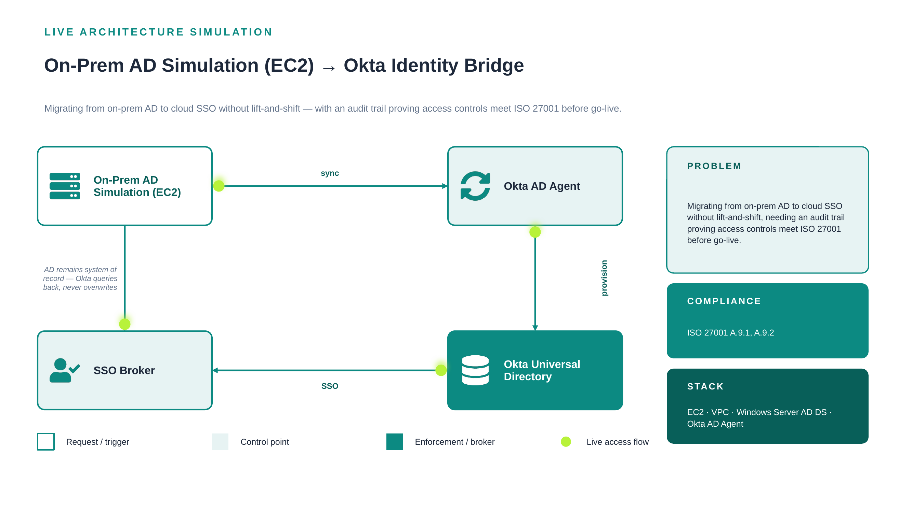

# 01. On-Prem AD Simulation (EC2) to Okta Identity Bridge

**Classification:** Internal Use - Portfolio Demonstration
**Control Owner:** Identity & Access Management (IAM) Engineering
**Document Status:** Approved
**Last Reviewed:** 2026-08-16
**Review Cadence:** Annual, or upon material architecture change

---

## 1. Executive Summary

Migrating from on-prem AD to cloud SSO without lift-and-shift, needing an audit trail proving access controls meet ISO 27001 before go-live. This document set describes the control designed and implemented to remediate that exposure, the residual risk accepted following implementation, and the evidence required to demonstrate the control is operating effectively.

## 2. Scope

This control applies to the identity and access systems described in Section 4 (Architecture) and the compliance requirements listed in Section 5. It does not extend to systems outside the stack listed below without a documented scope-extension review.

**In-scope systems:** EC2, VPC, Windows Server AD DS, Okta AD Agent

## 3. Risk Statement

**Inherent risk (pre-control):** Uncontrolled or undocumented directory migration could result in loss of authoritative identity data, inconsistent access decisions during cutover, or an inability to demonstrate access-control lineage during an ISO 27001 surveillance audit.

**Residual risk (post-control):** Low. AD remains the sole authoritative source during the bridge period; Okta operates strictly as a consuming service. Residual risk is limited to sync-latency windows between AD changes and Okta reflection, which is monitored and alerted.

## 4. Architecture



Full architecture rationale, alternatives considered, and consequences are documented in [`architecture/decision-record.md`](architecture/decision-record.md).

*Diagram legend: white/outlined nodes are the request trigger, tinted nodes are control points, solid-filled nodes are the enforcement/broker layer. The dashed loop shows the audit/feedback path back to the system of record.*

## 5. Compliance Mapping

| Requirement | Description |
|---|---|
| ISO 27001 A.9.1 | Business requirements of access control |
| ISO 27001 A.9.2 | User access management |

Full control testing procedure and evidence requirements are documented in [`compliance/compliance-mapping.md`](compliance/compliance-mapping.md).

## 6. Governing Policy

Formal, auditable policy statements for this control are documented in [`policies/access-control-policy.md`](policies/access-control-policy.md). All numbered statements use normative "shall" language consistent with ISO 27001 Annex A documentation conventions.

## 7. Evidence & Screenshots

This repository does not ship placeholder screenshots. [`screenshots/SCREENSHOTS_NEEDED.md`](screenshots/SCREENSHOTS_NEEDED.md) defines the exact evidence an auditor or control tester would expect to see, mapped to each implementation step.

## 8. Directory Structure

```
01-onprem-ad-okta-bridge/
├── README.md                      <- this document
├── architecture/
│   ├── architecture.png
│   └── decision-record.md         <- ADR: context, decision, alternatives, consequences
├── compliance/
│   └── compliance-mapping.md      <- control objective, testing procedure, evidence, residual risk
├── policies/
│   └── access-control-policy.md   <- formal policy statements, roles, exceptions, enforcement
├── screenshots/
│   └── SCREENSHOTS_NEEDED.md      <- evidence capture checklist
└── .gitattributes
```

## 9. Lessons Learned

Running AD DS on EC2 to simulate on-prem surfaced more DC replication and DNS quirks than any tutorial - cloud-hosted "on-prem" still behaves like on-prem.

---

[⬅ Back to portfolio index](../README.md)
